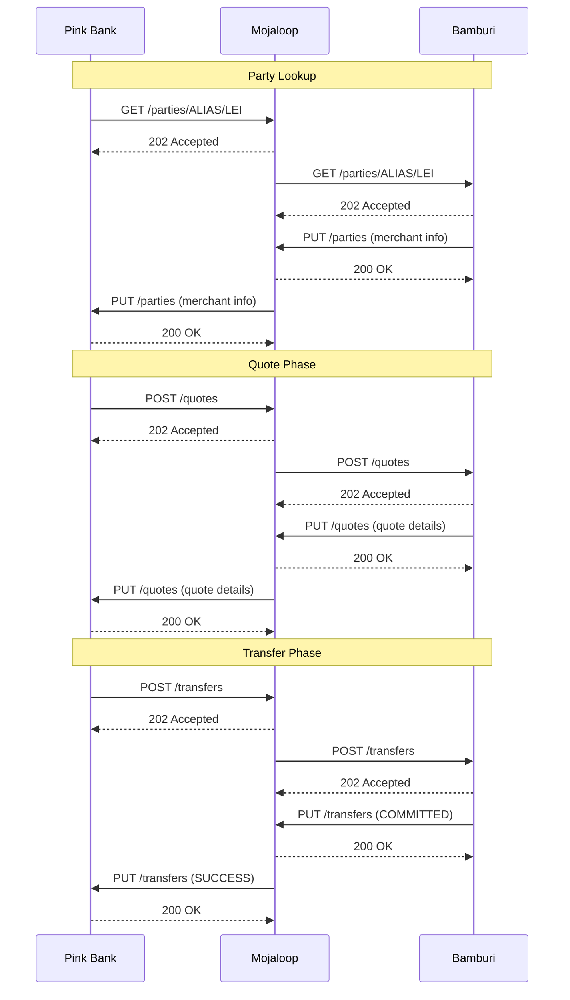

# LEI-Based Merchant Payment Demo - Complete Implementation Documentation

## Table of Contents

1. [Executive Summary](#executive-summary)
2. [Demo Overview](#demo-overview)
3. [System Architecture](#system-architecture)
4. [Payment Sequence](#payment-sequence)
5. [Demo Components](#demo-components)
6. [Merchant Registry Integration](#merchant-registry-integration)
7. [User Interface & Experience](#user-interface--experience)
8. [Testing & Validation](#testing--validation)
9. [Configuration Guide](#configuration-guide)
10. [Troubleshooting](#troubleshooting)

---

## Executive Summary

The **LEI Merchant Payments Demo** is a comprehensive testing interface built within the Mojaloop Testing Toolkit UI that demonstrates end-to-end business-to-business (B2B) payments using Legal Entity Identifiers (LEI). This demo showcases how merchants can send and receive payments using their globally unique LEI codes instead of traditional account numbers.

### Key Achievements

**Complete 24-Step Mojaloop Payment Flow** - Implements the full Mojaloop transfer with party lookup, quotes, and transfers

**Real LEI-Based Identification** - Uses actual Legal Entity Identifiers from GLEIF database for merchant identification

**Event-Driven Architecture** - Seamless, response-driven flow without artificial delays

**Live Registry Integration** - Connects to real merchant registry database for dynamic merchant lookups

**Visual Sequence Diagram** - Real-time visualization of API calls between participants

---

## Demo Overview

### What It Demonstrates

The demo simulates a complete payment scenario where:

**Payer Merchant:** Pink Bank (acting on behalf of customer Shuchita Prakash)

- Initiates payment to a payee merchant
- Looks up payee using their LEI code
- Requests a quote for the payment
- Executes the transfer

**Payee Merchant:** Bamburi Cement Public Limited Company

- LEI: `529900AXZOJO15EBGR24`
- Receives party lookup requests
- Provides quote information
- Confirms transfer receipt

**Mojaloop Switch:** Hub that orchestrates the payment

- Routes messages between participants
- Validates transactions
- Ensures payment atomicity

### Demo Capabilities

| Feature              | Description                                            |
| -------------------- | ------------------------------------------------------ |
| **LEI Lookup**       | Search merchants by their 20-character LEI code        |
| **QR Code Scanning** | Scan merchant QR codes containing LEI information      |
| **Manual Entry**     | Enter LEI codes manually for testing                   |
| **Live Database**    | Connect to real merchant registry for lookups          |
| **Fallback Mode**    | Works with hardcoded merchants if database unavailable |
| **Visual Tracking**  | Real-time sequence diagram shows all API interactions  |
| **Multi-Currency**   | Supports RWF (Rwandan Franc) and KSH (Kenyan Shilling) |

---

## System Architecture

### Component Overview

```
┌─────────────────────────────────────────────────────────────────┐
│                    ML Testing Toolkit UI                        │
│                                                                 │
│  ┌──────────────┐      ┌──────────────┐      ┌──────────────┐   │
│  │              │      │              │      │              │   │
│  │    Payer     │◄────►│   Mojaloop   │◄────►│    Payee     │   │
│  │   Merchant   │      │    Switch    │      │   Merchant   │   │
│  │  (Pink Bank) │      │     (Hub)    │      │  (Bamburi)   │   │
│  │              │      │              │      │              │   │
│  └──────┬───────┘      └──────┬───────┘      └──────┬───────┘   │
│         │                     │                     │           │
│         └─────────────────────┼─────────────────────┘           │
│                               │                                 │
└───────────────────────────────┼─────────────────────────────────┘
                                │
                                ▼
                   ┌────────────────────────┐
                   │ Merchant Registry      │
                   │ Oracle Database        │
                   │                        │
                   │ - LEI: 5299...R24      │
                   │ - DFSP: dfsp001        │
                   │ - Currency: RWF        │
                   └────────────────────────┘
```

## Payment Sequence

The demo implements the Mojaloop transfer protocol. This section explains each step in business terms.

### Phase 1: Party Lookup

**Purpose:** Discover if the payee merchant exists and which financial institution serves them.

#### Step 1: Payer Requests Merchant Information

```
Payer → Mojaloop: "Who is merchant with LEI 529900AXZOJO15EBGR24?"
API: GET /parties/ALIAS/529900AXZOJO15EBGR24
```

**What happens:** Pink Bank asks the Mojaloop switch to find information about the payee merchant.

#### Step 2: Mojaloop Acknowledges Request

```
Mojaloop → Payer: "Request received, processing..."
Response: HTTP 202 (Accepted)
```

**What happens:** Switch confirms it received the request and will look up the merchant.

#### Step 3: Mojaloop Queries Payee's Institution

```
Mojaloop → Payee: "Do you know this LEI: 529900AXZOJO15EBGR24?"
API: GET /parties/ALIAS/529900AXZOJO15EBGR24
```

**What happens:** Switch forwards the lookup to the payee's financial institution.

#### Step 4: Payee Acknowledges Lookup

```
Payee → Mojaloop: "Checking our records..."
Response: HTTP 202 (Accepted)
```

**What happens:** Payee's institution confirms it received the lookup request.

#### Step 5: Payee Provides Merchant Details

```
Payee → Mojaloop: "Yes, we serve this merchant. Here are the details."
API: PUT /parties/ALIAS/529900AXZOJO15EBGR24
Body: {
  "party": {
    "partyIdType": "ALIAS",
    "partyIdentifier": "529900AXZOJO15EBGR24",
    "name": "Bamburi Cement Public Limited Company",
    "merchantClassificationCode": "5211"
  }
}
```

**What happens:** Payee sends the merchant's information back to the switch.

#### Step 6: Mojaloop Confirms Receipt

```
Mojaloop → Payee: "Information received, thank you."
Response: HTTP 200 (OK)
```

#### Step 7: Mojaloop Informs Payer

```
Mojaloop → Payer: "Found the merchant! Here's their information."
API: PUT /parties/ALIAS/529900AXZOJO15EBGR24
Body: {merchant details}
```

**What happens:** Switch delivers the merchant information to the payer.

#### Step 8: Payer Confirms Receipt

```
Payer → Mojaloop: "Got it, proceeding with quote request."
Response: HTTP 200 (OK)
```

**Result:** Merchant found! User can now request a payment quote.

---

### Phase 2: Quote Request (Steps 9-16)

**Purpose:** Determine the exact cost of the transaction including fees and foreign exchange rates.

#### Step 9: Payer Requests Quote

```
Payer → Mojaloop: "How much to send 100 RWF to this merchant?"
API: POST /quotes
Body: {
  "quoteId": "unique-quote-id",
  "transactionId": "unique-txn-id",
  "payer": {
    "partyIdType": "ALIAS",
    "partyIdInfo": {
      "partyIdType": "ALIAS",
      "partyIdentifier": "{payer_LEI}"
    }
  },
  "payee": {
    "partyIdType": "ALIAS",
    "partyIdInfo": {
      "partyIdType": "ALIAS",
      "partyIdentifier": "529900AXZOJO15EBGR24"
    }
  },
  "amountType": "SEND",
  "amount": {
    "currency": "RWF",
    "amount": "100"
  },
  "transactionType": {
    "scenario": "PAYMENT",
    "initiator": "PAYER",
    "initiatorType": "BUSINESS"
  }
}
```

**What happens:** Payer asks for a quote to send money to the merchant.

#### Step 10: Mojaloop Acknowledges Quote Request

```
Mojaloop → Payer: "Quote request received, calculating..."
Response: HTTP 202 (Accepted)
```

#### Step 11: Mojaloop Requests Quote from Payee

```
Mojaloop → Payee: "Can you provide a quote for this transaction?"
API: POST /quotes
Body: {same quote request details}
```

**What happens:** Switch forwards the quote request to payee's institution.

#### Step 12: Payee Acknowledges Quote Request

```
Payee → Mojaloop: "Calculating fees and processing..."
Response: HTTP 202 (Accepted)
```

#### Step 13: Payee Provides Quote

```
Payee → Mojaloop: "Here's our quote with fees."
API: PUT /quotes/{quoteId}
Body: {
  "transferAmount": {
    "currency": "RWF",
    "amount": "100"
  },
  "payeeReceiveAmount": {
    "currency": "RWF",
    "amount": "95"
  },
  "payeeFspFee": {
    "currency": "RWF",
    "amount": "2"
  },
  "payeeFspCommission": {
    "currency": "RWF",
    "amount": "3"
  },
  "ilpPacket": "{encoded_packet}",
  "condition": "{crypto_condition}"
}
```

**What happens:** Payee calculates and returns the total cost breakdown.

#### Step 14: Mojaloop Confirms Quote Receipt

```
Mojaloop → Payee: "Quote received."
Response: HTTP 200 (OK)
```

#### Step 15: Mojaloop Delivers Quote to Payer

```
Mojaloop → Payer: "Here's the quote - total 100 RWF, payee receives 95 RWF"
API: PUT /quotes/{quoteId}
Body: {quote details}
```

**What happens:** Switch delivers the complete quote to the payer.

#### Step 16: Payer Confirms Quote Receipt

```
Payer → Mojaloop: "Quote received, ready to transfer."
Response: HTTP 200 (OK)
```

**Result:** ✅ Quote received! User can now execute the transfer.

---

### Phase 3: Transfer Execution

**Purpose:** Execute the actual money transfer from payer to payee.

#### Step 17: Payer Initiates Transfer

```
Payer → Mojaloop: "Execute the transfer!"
API: POST /transfers
Body: {
  "transferId": "unique-transfer-id",
  "payerFsp": "pinkbank",
  "payeeFsp": "bamburi_bank",
  "amount": {
    "currency": "RWF",
    "amount": "100"
  },
  "ilpPacket": "{from_quote}",
  "condition": "{from_quote}",
  "expiration": "2024-01-17T10:45:00.000Z"
}
```

**What happens:** Payer commits to the transfer with the agreed quote.

#### Step 18: Mojaloop Acknowledges Transfer

```
Mojaloop → Payer: "Transfer request received, processing..."
Response: HTTP 202 (Accepted)
```

#### Step 19: Mojaloop Notifies Payee of Transfer

```
Mojaloop → Payee: "Funds incoming! Please confirm."
API: POST /transfers
Body: {transfer details}
```

**What happens:** Switch reserves funds and notifies payee.

#### Step 20: Payee Acknowledges Transfer

```
Payee → Mojaloop: "Transfer notification received, verifying..."
Response: HTTP 202 (Accepted)
```

#### Step 21: Payee Commits Transfer

```
Payee → Mojaloop: "Transfer verified and accepted!"
API: PUT /transfers/{transferId}
Body: {
  "fulfilment": "{crypto_fulfilment}",
  "transferState": "COMMITTED",
  "completedTimestamp": "2024-01-17T10:44:30.000Z"
}
```

**What happens:** Payee confirms receipt and commits the transaction.

#### Step 22: Mojaloop Confirms Commitment

```
Mojaloop → Payee: "Commitment received."
Response: HTTP 200 (OK)
```

#### Step 23: Mojaloop Notifies Payer of Success

```
Mojaloop → Payer: "Transfer successful! Funds delivered."
API: PUT /transfers/{transferId}
Body: {
  "fulfilment": "{crypto_fulfilment}",
  "transferState": "COMMITTED",
  "completedTimestamp": "2024-01-17T10:44:30.000Z"
}
```

**What happens:** Switch confirms to payer that transfer completed successfully.

#### Step 24: Payer Acknowledges Success

```
Payer → Mojaloop: "Success acknowledged!"
Response: HTTP 200 (OK)
```

**Result:** PAYMENT COMPLETE! Money successfully transferred.

---

## Demo Components

### 1. Payer Merchant Interface (PayerMerchant.jsx)

**Role:** Represents the merchant or bank initiating the payment.

**Key Features:**

#### QR Code Scanner

- Allows scanning merchant QR codes
- Automatically extracts LEI from QR data
- Validates LEI format (20 alphanumeric characters)

#### Manual LEI Lookup

- Text input for entering LEI codes
- Real-time validation
- Integration with merchant registry database

#### Payment Form

- Amount input (default: 100)
- Currency selection (RWF or KSH)
- Dynamic button states based on payment phase

#### State Management

The interface progresses through distinct stages:

```
1. Initial State → "Start Payment" button
2. Party Lookup → Loading "Looking up merchant..."
3. Merchant Found → Show merchant details + "Get Quote" button
4. Quote Requested → Loading "Getting quote..."
5. Quote Received → Show quote details + "Transfer Money" button
6. Transfer Processing → Loading "Processing transfer..."
7. Transfer Complete → Show success + "Reset" button
```

### 2. Payee Merchant Interface (PayeeMerchant.jsx)

**Role:** Represents the merchant receiving the payment.

**Key Features:**

#### Automatic Response Handling

- Listens for incoming party lookup requests
- Automatically provides merchant information
- Generates quotes based on configured fees
- Confirms transfer receipt

#### Simulated Business Logic

```javascript
// Fee calculation example
payeeFspFee = transferAmount * 0.02 (2%)
payeeFspCommission = transferAmount * 0.03 (3%)
payeeReceiveAmount = transferAmount - fees - commission
```

#### Event Coordination

- Responds to GET /parties requests
- Calculates and sends PUT /quotes responses
- Confirms PUT /transfers with fulfilment

### 3. Mojaloop Switch Console (HUBConsole.jsx)

**Role:** Central hub that routes all messages.

**Functionality:**

- Displays all incoming/outgoing messages
- Shows routing decisions
- Logs transaction states
- Provides debugging information

### 4. Sequence Diagram Visualizer (TestDiagram.jsx)

**Role:** Real-time visualization of payment flow.

**Features:**

#### Automatic Diagram Generation

```
Payer Merchant    Mojaloop Switch    Payee Merchant
      |                  |                  |
      |---GET /parties-->|                  |
      |<---HTTP 202------|                  |
      |                  |---GET /parties-->|
      |                  |<---HTTP 202------|
      |                  |<---PUT /parties--|
      |                  |---HTTP 200------>|
      |<---PUT /parties--|                  |
      |---HTTP 200------>|                  |
```

#### Phase Annotations

- "Party Lookup (Oracle)"
- "Quote Request"
- "Transfer Execution"

#### Color Coding

- Solid lines: Requests
- Dashed lines: Responses
- Highlighted: Active participants

### 5. Transaction Monitor (TestMonitor.jsx)

**Role:** Detailed logging of all API interactions.

**Displays:**

- HTTP method and endpoint
- Request/response headers
- Request/response body
- Timestamps
- Status codes

---

## Merchant Registry Integration

### Connection Architecture

The demo connects to your merchant registry in two ways:

#### 1. Direct Registry Oracle API

```javascript
// Call to registry-oracle service
GET http://localhost:8888/parties/ALIAS/529900AXZOJO15EBGR24

// Expected response from registry-oracle
{
  "partyList": [
    {
      "fspId": "bamburi_dfsp",
      "currency": "RWF",
      "lei": "529900AXZOJO15EBGR24",
      "alias_value": "529900AXZOJO15EBGR24"
    }
  ]
}
```

#### 2. Fallback Configuration

If registry is unavailable, uses `merchants.json`:

```json
{
  "payer": {
    "name": "Shuchita Prakash",
    "bank": "Pink Bank",
    "bankAccountId": "123456789"
  },
  "payee": {
    "name": "Bamburi Cement Public Limited Company",
    "lei": "529900AXZOJO15EBGR24",
    "merchantId": "10000007"
  },
  "currencies": ["RWF", "KSH"]
}
```

### Integration Flow

```
User enters/scans LEI
        ↓
Validate LEI format (20 chars, alphanumeric)
        ↓
Try: Call registry-oracle API
        ↓
   ┌────┴────┐
   │         │
Success   Failure
   │         │
   │         └→ Fallback: Use merchants.json
   │
   ├→ Extract merchant data from response
   │
   └→ Display in UI: "✅ Using real merchant registry data!"
```

### Database Query Path

When registry-oracle receives a request:

```sql
-- Registry-oracle queries MySQL
SELECT
  fspId,
  currency,
  lei,
  alias_value
FROM registry
WHERE alias_value = '529900AXZOJO15EBGR24'
  AND alias_type = 'LEI'
```

### Benefits of Live Integration

✅ **Dynamic Merchant Discovery** - No hardcoded values  
✅ **Real-Time Data** - Always current merchant information  
✅ **Production Testing** - Tests actual database queries  
✅ **Multi-Merchant Support** - Can look up any registered merchant  
✅ **Audit Trail** - All lookups logged in database

---

## User Interface & Experience

### Step-by-Step User Journey

#### 1. Landing Page

**Display:**

- Payer merchant card (Pink Bank)
- Payee merchant card (Bamburi Cement)
- "Start Payment" button

**User Action:** Click "Start Payment"

---

#### 2. Merchant Lookup Phase

**Display:**

- Loading spinner
- Message: "Looking up merchant information..."
- LEI being queried: `529900AXZOJO15EBGR24`

**Behind the scenes:**

- GET /parties API call
- Registry database lookup
- Payee merchant response coordination

**Duration:** 2-5 seconds

---

#### 3. Merchant Details Display

**Display:**

- ✅ "Merchant Found!"
- Merchant Name: "Bamburi Cement Public Limited Company"
- LEI: `529900AXZOJO15EBGR24`
- Amount input field (pre-filled: 100)
- Currency dropdown (RWF or KSH)
- "Get Quote" button

**User Action:**

- Optionally adjust amount
- Select currency
- Click "Get Quote"

---

#### 4. Quote Request Phase

**Display:**

- Loading spinner
- Message: "Getting quote..."
- Selected amount and currency

**Behind the scenes:**

- POST /quotes API call
- Payee calculates fees and commission
- Quote response coordination

**Duration:** 2-5 seconds

---

#### 5. Quote Details Display

**Display:**

- 📊 "Quote Received!"
- **Send Amount:** 100 RWF
- **Payee Receives:** 95 RWF
- **Fees:** 2 RWF
- **Commission:** 3 RWF
- "Transfer Money" button
- "Cancel" button

**User Action:**

- Review quote details
- Click "Transfer Money" to proceed
- Or "Cancel" to restart

---

#### 6. Transfer Processing Phase

**Display:**

- Loading spinner
- Message: "Processing transfer..."
- Transfer ID displayed

**Behind the scenes:**

- POST /transfers API call
- Cryptographic fulfilment validation
- Payee commits transaction
- Ledger updates

**Duration:** 2-5 seconds

---

#### 7. Success Confirmation

**Display:**

- ✅ "Payment Successful!"
- **Transfer ID:** unique-transfer-id
- **Amount:** 100 RWF
- **Payee:** Bamburi Cement Public Limited Company
- **Status:** COMMITTED
- "Reset" button to start new payment

**User Action:** Click "Reset" to start another payment

---

### Visual Feedback Elements

#### Color Scheme

- **Green:** Success states, completed steps
- **Blue:** Active/in-progress operations
- **Orange:** Pending/waiting states
- **Red:** Errors or failed operations

#### Icons

- ✅ Success checkmark
- 🔄 Loading spinner
- 📊 Quote/financial information
- 💳 Payment/transfer
- 🔍 Lookup/search
- 📱 QR code scanner

#### Real-Time Sequence Diagram

The sequence diagram updates automatically as each step completes:



## Conclusion

The LEI Merchant Payments Demo successfully demonstrates:

**Complete Mojaloop Implementation** - All 24 steps of the transfer protocol

**Real LEI Integration** - Uses actual Legal Entity Identifiers for merchant identification

**Live Database Connectivity** - Integrates with merchant registry for dynamic lookups

**Event-Driven Architecture** - Seamless, response-based flow without artificial delays

**Production-Ready Testing** - Suitable for validating real payment scenarios

**User-Friendly Interface** - Clear visual feedback and intuitive workflow

### Key Achievements

| Aspect               | Implementation             | Status   |
| -------------------- | -------------------------- | -------- |
| Party Lookup         | GET/PUT /parties with LEI  | Complete |
| Quote Request        | POST/PUT /quotes           | Complete |
| Transfer Execution   | POST/PUT /transfers        | Complete |
| Registry Integration | Live database lookups      | Complete |
| Visual Feedback      | Real-time sequence diagram | Complete |
| Error Handling       | Graceful fallbacks         | Complete |
| Multi-Currency       | RWF, KSH support           | Complete |
